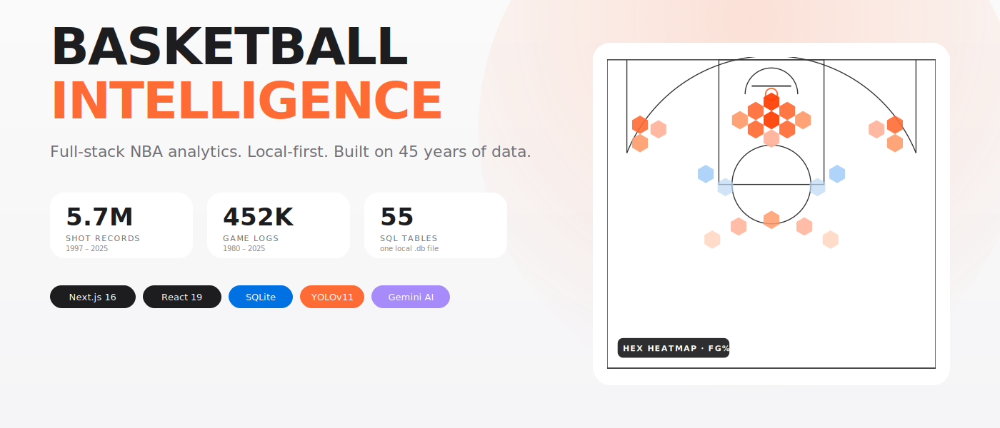
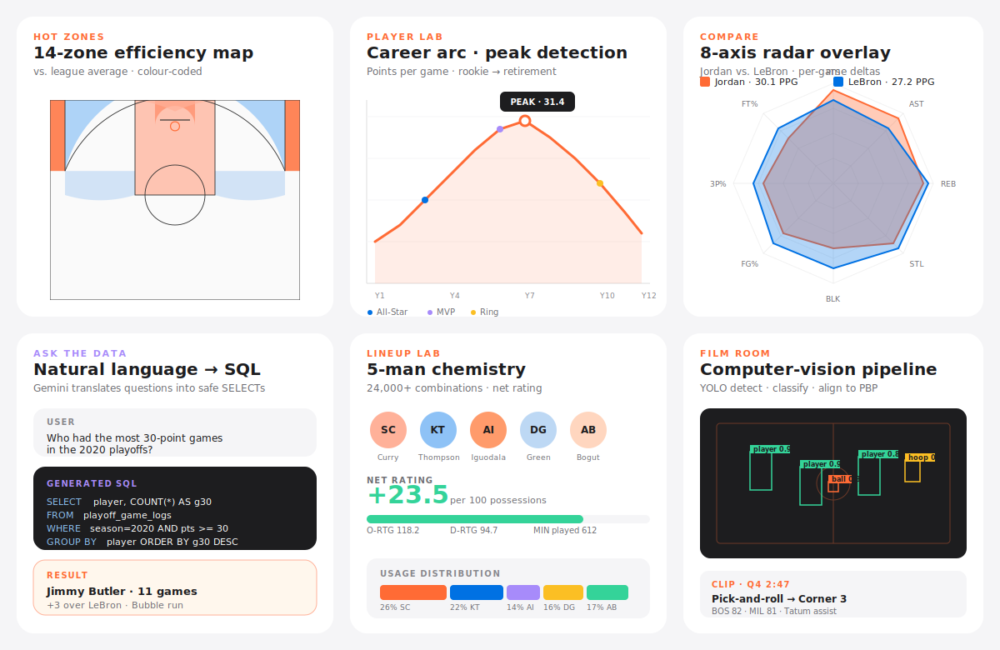
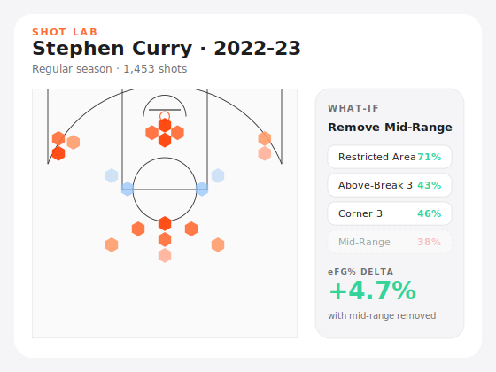
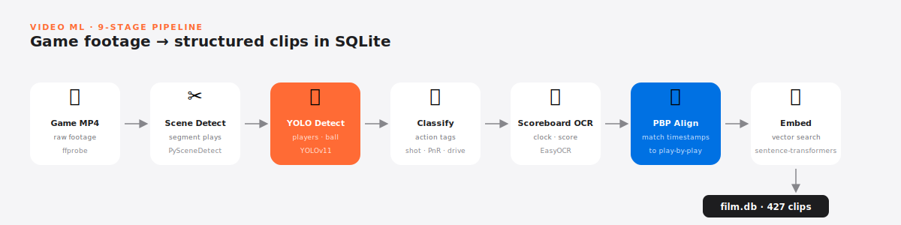
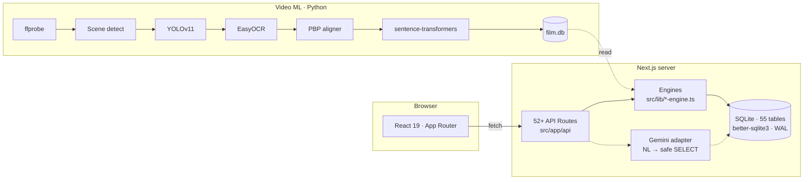
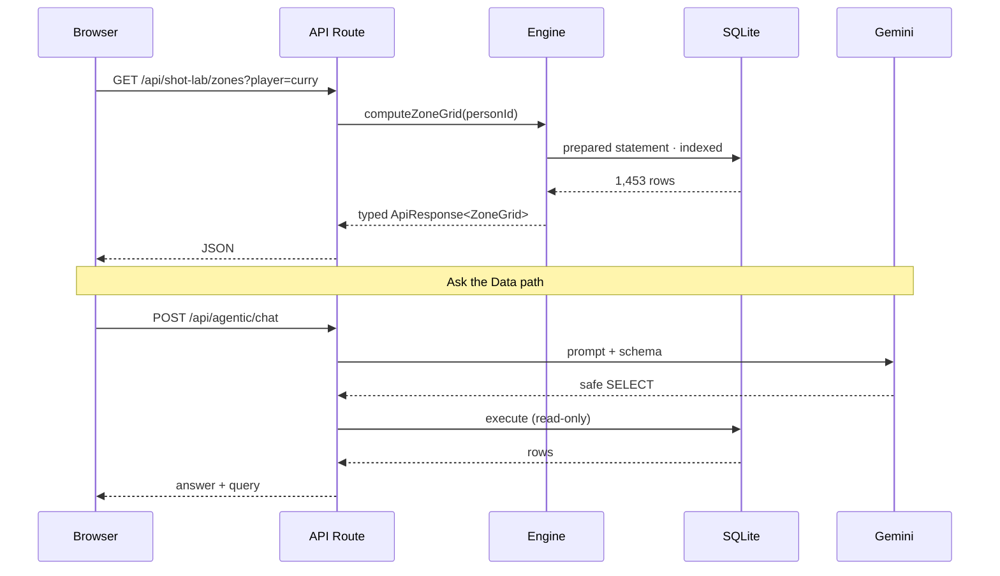

<div align="center">



<br/>

[](https://nextjs.org)
[](https://react.dev)
[](https://www.typescriptlang.org)
[](https://www.sqlite.org)
[](https://github.com/ultralytics/ultralytics)
[](https://ai.google.dev)
[](#testing)

**A local-first NBA analytics platform. No cloud DB. No API limits. 45 years of basketball in one file.**

</div>

---

## ✨ What it does

Explore 45 years of NBA history through shot heatmaps, player comparisons, AI-powered natural language queries, and computer vision film analysis — all running on your laptop.

<div align="center">



</div>

## 📊 The data scale

| Dataset | Records | Coverage |
|---|---:|---|
| 🎯 Shot records (with court coordinates) | **5,700,000+** | 1997 – 2025 |
| 📓 Player game logs | **452,000+** | 1980 – 2025 |
| 📈 Per-game season stats | **24,600+** | 1980 – 2025 |
| 🧮 Advanced season stats | **24,400+** | 1980 – 2025 |
| 🏆 Playoff shot records | **380,000+** | 1997 – 2025 |
| 👤 Player biographies | **5,407** | 1947 – 2025 |
| 🧩 Lineup combinations | **24,000+** | 2008 – 2025 |

One SQLite file. Read-only WAL mode. No cloud database. No API rate limits. No external dependencies for core features.

---

## 🔥 Feature spotlight

### Shot Lab — hex heatmaps and what-if simulations

<div align="center">

</div>

Hexbin heatmaps over a full NBA half-court. Compare two shooters side-by-side. The **what-if panel** strips out a zone and recalculates effective field goal percentage — answer questions like _"what if Curry never took a mid-range shot?"_ against the real 5.7M-shot dataset.

### Hot Zones — 14-zone efficiency grid

A court divided into 14 discrete zones, each tinted by efficiency relative to league average. Track how a player's preferred spots shift season by season, and see where teams over- or under-perform the league baseline.

### Player Lab — career arcs with peak detection

Career arcs rendered with milestone markers (All-Star, MVP, ring), peak detection, and **k-nearest-neighbor similarity search** across all 5,407 players. Find every player whose trajectory statistically mirrors another.

### Ask the Data — natural language → SQL

Ask a question in plain English. Gemini translates it to a safe `SELECT` statement, runs it against the local database, and returns the answer **alongside the query that produced it** — so you can always see and trust the reasoning.

### Film Room — computer-vision play analysis

<div align="center">

</div>

Upload game footage. A nine-stage Python pipeline detects players, ball, and hoop with YOLOv11, segments scenes, classifies actions (shot / drive / pick-and-roll), OCRs the scoreboard for clock and score, aligns clips to play-by-play data, and writes structured metadata to `film.db`. **Browse 427 pre-analyzed clips** with court diagrams and tag filters.

### Compare · Matchups · Lineup Lab · Team DNA

- **Compare** — 8-axis radar overlays with per-game deltas and similarity scoring
- **Matchups** — head-to-head rivalry breakdowns, game logs, and edge analysis
- **Lineup Lab** — 5-man chemistry analyzer across 24K+ lineup records
- **Team DNA** — franchise profiles with rosters, standings, usage distribution
- **Stories** — scrollytelling narratives driven by real data (rise of the three, pace-and-space era)
- **Play** — trivia pulled from real records; guess players from anonymized shot charts
- **Explore** — directory of every player with era/team/position filters and real headshots

---

## 🏗️ Architecture



All database access flows through engines in `src/lib/` — route handlers stay thin. Engines handle similarity search, zone aggregation, career arc detection, matchup resolution, and timeline construction.

### Request lifecycle



---

## 🛠️ Tech stack

| Layer | Stack |
|---|---|
| **Frontend** | Next.js 16 · React 19 · TypeScript 5 · Tailwind CSS 4 |
| **Visualisation** | D3 v7 (hexbins, radar, SVG courts) · Recharts · Framer Motion |
| **Database** | SQLite via `better-sqlite3` — 55 tables, ~1.7 GB |
| **AI** | Google Gemini (natural language → SQL) |
| **Video ML** | Python · YOLOv11 · OpenCV · EasyOCR · sentence-transformers |
| **Testing** | Vitest + Testing Library (67 tests) · pytest (80+ tests) |

---

## 🚀 Getting started

```bash
git clone https://github.com/madhavcodez/basketballintelligence.git
cd basketballintelligence
npm install

cp .env.example .env.local
# Add GEMINI_API_KEY for the /ask feature (optional)

npm run dev
```

Expects `data/basketball.db` — build from CSVs with `scripts/ingest.py` or drop in a pre-built copy.

### Video ML pipeline (optional)

```bash
cd video-ml
pip install -r requirements.txt
python -m scripts.process_game --input game.mp4
```

Every heavy dependency has a fallback — runs without YOLO, ffmpeg, or sentence-transformers installed by falling back to deterministic alternatives.

### Docker

```bash
docker build -t basketball-intelligence .
docker run -p 3000:3000 -v $(pwd)/data:/app/data basketball-intelligence
```

---

## 📁 Project structure

```
src/
├── app/
│   ├── (pages)/         # 12 feature pages
│   └── api/             # 52+ route handlers
├── components/
│   ├── charts/          # RadarChart · ShotChart · HotZoneChart · TrendLine
│   ├── court/           # SVG court · hexbin overlays · zone maps
│   ├── film/            # Clip player · timeline · upload · analysis
│   ├── matchup/         # Head-to-head display
│   ├── timeline/        # Career arc visualisation
│   ├── cards/           # Stat cards · insight summaries
│   └── ui/              # Shared primitives
├── lib/
│   ├── db.ts            # SQLite query layer
│   ├── *-engine.ts      # Feature engines
│   └── film-db.ts       # Video clip database layer
video-ml/                # Python YOLO pipeline (9 processing stages)
scripts/                 # Data ingestion and validation
tests/                   # Regression and schema tests
```

---

## 🔌 API surface

Every endpoint returns a typed `ApiResponse<T>` envelope. Selected routes:

| Method | Route | Purpose |
|---|---|---|
| `GET` | `/api/players/search?q=` | Player typeahead |
| `GET` | `/api/players/[name]/shots` | Shot records with court coordinates |
| `GET` | `/api/players/[name]/similar` | k-nearest neighbors |
| `GET` | `/api/shot-lab/zones` | Zone efficiency grid |
| `POST` | `/api/shot-lab/whatif` | Zone removal simulation |
| `GET` | `/api/matchup/games?a=&b=` | Head-to-head game log |
| `POST` | `/api/agentic/chat` | Natural language → SQL |
| `POST` | `/api/film/upload` | Video upload |
| `GET` | `/api/film/clips` | Clip search by tag |

---

## 🎨 Design system

Apple-inspired light mode with a single orange accent. No dark-on-dark, no gradient-abuse, no generic template feel.

| Token | Value |
|---|---|
| Base background | `#FAFAFA` |
| Card | `#FFFFFF` |
| Primary text | `#1D1D1F` |
| Secondary text | `#6E6E73` |
| Accent (court rim · heat) | `#FF6B35` |
| Secondary accent | `#0071E3` |
| Success | `#34D399` |
| Fonts | Syne (display) · Inter (body) · JetBrains Mono (data) |

Dark mode is a CSS `invert(1) hue-rotate(180deg)` of the whole page, with media re-inverted — one-line theme parity without maintaining two palettes.

---

## 📚 Data sources

Basketball Reference · NBA Stats · public play-by-play feeds.

Ingestion is offline and idempotent (`scripts/ingest.py`). The database is read-only at runtime, opened in WAL mode for safe concurrent reads.

---

<div align="center">

Built by [**@madhavcodez**](https://github.com/madhavcodez)

_5.7 million shots. 45 years. One SQLite file._

</div>
